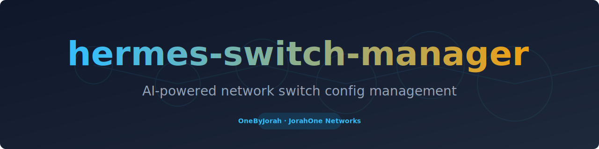
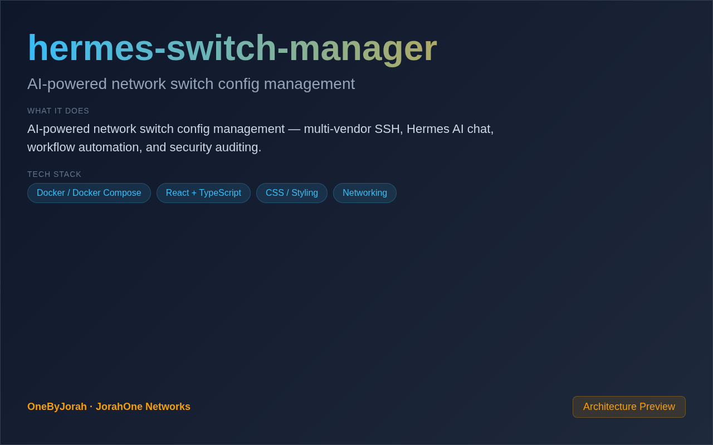

<div align="center">



# hermes-switch-manager

AI-powered network switch config management


</div>

---

<p align="center">
  
</p>

<br>

---

## Features

- **Multi-Vendor Support** — Manage Cisco, HP Aruba, Juniper, Arista, and Linux devices.
- **AI Chat Interface** — Hermes AI agent for natural language network operations.
- **Workflow Automation** — IRIS-style workflow engine for disciplined config changes.
- **Security Auditing** — CVE scanning, AAA checks, CIS/NIST compliance.
- **Containerlab Integration** — Auto-discovery and sync of lab topologies.
- **Template Engine** — 45+ Jinja2 templates for common network tasks.
- **Next.js Dashboard** — Modern, responsive web interface.
- **Docker Compose** — One-command production deployment.

## Quick Start

```bash
git clone https://github.com/OneByJorah/hermes-switch-manager.git
cd hermes-switch-manager

cp .env.example .env  # Configure OpenAI key
docker compose up -d
```

Open **http://localhost:3000** in your browser.

### Local Development

```bash
cd backend
pip install -r requirements.txt
uvicorn main:app --reload --port 8000

# Frontend
cd frontend
npm install
npm run dev
```

## Environment Variables

| Variable | Default | Description |
|----------|---------|-------------|
| `DATABASE_URL` | `sqlite:///hermes.db` | Database connection string |
| `OPENAI_API_KEY` | *(empty)* | OpenAI API key for Hermes AI |
| `DEFAULT_SSH_USERNAME` | `admin` | Default SSH username |
| `DEFAULT_SSH_PASSWORD` | — | Default SSH password |

## Architecture

```
Browser (Next.js) ──API──▶ FastAPI Backend ──▶ SQLAlchemy ──▶ SQLite
                                │
                                ├──▶ Netmiko (SSH) ──▶ Network Switches
                                ├──▶ Hermes AI (OpenAI)
                                ├──▶ Jinja2 Templates
                                ├──▶ Workflow Engine
                                └──▶ Security Auditor
```

## Tech Stack

- **Backend**: FastAPI (Python 3.11+), SQLAlchemy, Netmiko
- **Frontend**: Next.js 14 (TypeScript)
- **AI**: OpenAI GPT (Hermes agent)
- **Templates**: Jinja2 (45+ built-in)
- **Database**: SQLite (default), PostgreSQL (production)
- **Deployment**: Docker Compose

## Project Structure

```
hermes-switch-manager/
├── backend/
│   ├── main.py              # FastAPI application
│   ├── services/            # Business logic
│   ├── routers/             # API endpoints
│   └── models/              # Database models
├── frontend/
│   ├── src/app/             # Next.js pages
│   └── package.json
├── templates/               # Jinja2 config templates
├── docker-compose.yml       # Docker deployment
└── .env.example             # Configuration template
```

## API Endpoints

| Endpoint | Method | Description |
|----------|--------|-------------|
| `/api/switches` | GET/POST | Manage network switches |
| `/api/configs/{id}` | GET | Retrieve device configuration |
| `/api/templates` | GET | List Jinja2 templates |
| `/api/chat` | POST | Chat with Hermes AI agent |
| `/api/workflows` | GET/POST | Manage configuration workflows |
| `/api/security/audit` | POST | Run security audit |

## Contributing

Contributions are welcome. Please see [CONTRIBUTING.md](CONTRIBUTING.md) for guidelines and [CODE_OF_CONDUCT.md](CODE_OF_CONDUCT.md) for community standards.

## Security

For security concerns, see [SECURITY.md](SECURITY.md). Please report vulnerabilities to **info@jorahone.com** — do not use public issues.

## License

MIT © Jhonattan L. Jimenez

---

## 🤝 Contributing

See [CONTRIBUTING.md](CONTRIBUTING.md). All contributions follow the [Code of Conduct](CODE_OF_CONDUCT.md).

## 🔒 Security

Found a vulnerability? Please follow our [Security Policy](SECURITY.md) and report privately to `security@jorahone.com`.

## 📄 License

[MIT License](LICENSE) © Jhonattan L. Jimenez (OneByJorah)

---

<p align="center">Built with 🌴 by <a href="https://github.com/OneByJorah">OneByJorah</a> · <a href="https://jorahone.com">jorahone.com</a></p>
