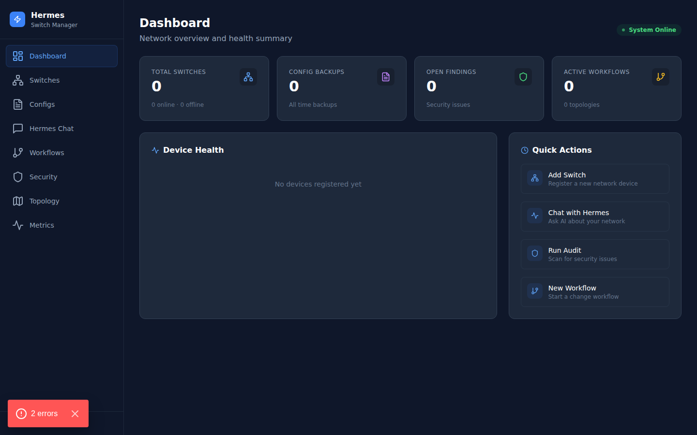
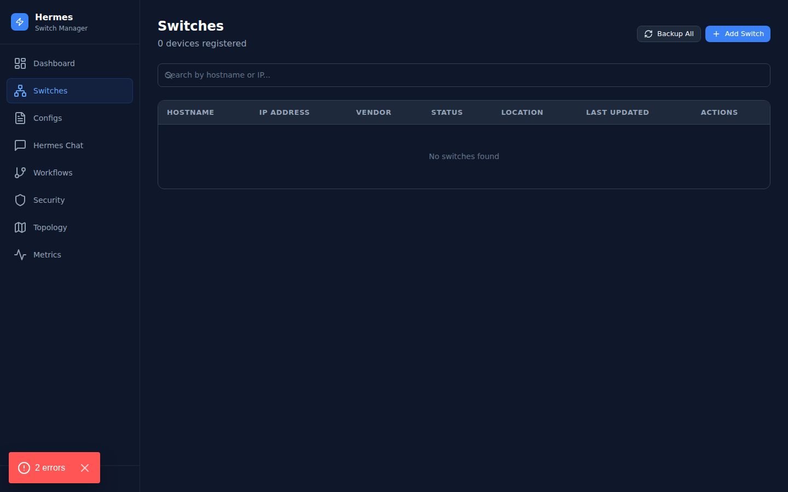
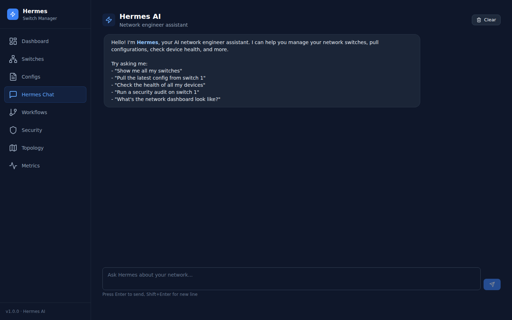

# Hermes Switch Manager ⚡

**AI-powered network switch configuration management** — a comprehensive, open-source platform that combines multi-vendor SSH management, an AI chat assistant, workflow automation, security auditing, Containerlab topology integration, and real-time device monitoring.

> Inspired by [IRIS](https://github.com/kiskander/iris), [NetClaw](https://github.com/automateyournetwork/netclaw), and [AINetworkHelperForContainerLab](https://github.com/zerxen/AINetworkHelperForContainerLab).

---

## Features ✨

| Feature | Description |
|---------|-------------|
| **🔌 Multi-Vendor SSH** | Cisco IOS/XE/X, Juniper JunOS, Arista EOS, Linux — via Netmiko |
| **🤖 Hermes AI Agent** | OpenAI-powered chat assistant with tool calling (pull configs, check health, run audits) |
| **📋 Config Management** | Backup, version history, unified diff, change detection |
| **🔄 Workflow Engine** | IRIS-style disciplined workflow: Discover → Verify → Propose → Confirm → Execute → Verify → Document |
| **🔒 Security Auditing** | CVE scanning, ACL review, AAA checks, password policy, compliance (CIS/NIST) |
| **🗺️ Containerlab Integration** | Auto-discover topologies, parse .clab.yml, sync devices |
| **📊 Health Monitoring** | Real-time CPU, memory, interface metrics with time-series data |
| **📜 Audit Trail** | Immutable audit logs for all state-changing actions |
| **🌐 Web Dashboard** | Next.js frontend with dark theme, tables, charts, and streaming AI chat |

---

## 📸 Screenshots

> Captured from the running app (FastAPI backend + Next.js frontend) during this polish pass.

| Dashboard | Switches | AI Chat |
|-----------|----------|---------|
|  |  |  |

---

## Quick Start 🚀

### Prerequisites
- Python 3.11+
- Node.js 18+
- Docker & Docker Compose (optional)

### Local Development

```bash
# 1. Clone and enter
git clone https://github.com/OneByJorah/hermes-switch-manager.git
cd hermes-switch-manager

# 2. Backend setup
cd backend
cp .env.example .env
# Edit .env: add OPENAI_API_KEY, SSH credentials
pip install -r requirements.txt
uvicorn main:app --reload --host 0.0.0.0 --port 8000

# 3. Frontend setup (new terminal)
cd frontend
npm install
npm run dev
```

Backend → http://localhost:8000 (API docs at /docs)  
Frontend → http://localhost:3000

### Docker Compose

```bash
docker-compose up -d
```

---

## Architecture 🏗️

```
hermes-switch-manager/
├── backend/                  # FastAPI Python backend
│   ├── main.py              # App entry point + lifespan
│   ├── config.py            # Pydantic settings
│   ├── database.py          # SQLAlchemy engine + session
│   ├── models/              # Database models
│   │   └── __init__.py      # Switch, ConfigBackup, ChatMessage, Workflow, etc.
│   ├── schemas.py           # Pydantic request/response schemas
│   ├── services/            # Business logic
│   │   ├── netmiko_client.py       # Multi-vendor SSH client
│   │   ├── hermes_agent.py         # AI agent with tool calling
│   │   ├── workflow_engine.py       # IRIS workflow engine
│   │   ├── containerlab_service.py # Topology parser
│   │   └── security_auditor.py     # CVE, ACL, AAA audits
│   ├── routers/             # FastAPI routers
│   │   ├── switches.py      # CRUD + sync + health
│   │   ├── configs.py       # Config backup + diff
│   │   ├── chat.py          # SSE streaming chat
│   │   ├── workflows.py     # Workflow lifecycle
│   │   ├── dashboard.py     # Stats + metrics
│   │   ├── security.py      # Findings + audit
│   │   └── containerlab.py  # Topology endpoints
│   ├── Dockerfile
│   └── requirements.txt
├── frontend/                 # Next.js 14 frontend
│   ├── src/
│   │   ├── app/             # Pages (dashboard, switches, configs, chat, etc.)
│   │   ├── components/      # Reusable components
│   │   └── lib/             # API client + utils
│   ├── Dockerfile
│   └── package.json
├── docker-compose.yml        # Full stack deployment
├── scripts/                  # Utility scripts
└── docs/                     # Documentation
```

---

## API Endpoints 🔌

### Switches
| Method | Path | Description |
|--------|------|-------------|
| GET | `/api/switches/` | List switches |
| POST | `/api/switches/` | Add switch |
| GET | `/api/switches/{id}` | Get switch |
| PUT | `/api/switches/{id}` | Update switch |
| DELETE | `/api/switches/{id}` | Delete switch |
| POST | `/api/switches/{id}/sync` | Pull config via SSH |
| POST | `/api/switches/{id}/health` | Health check |
| POST | `/api/switches/{id}/commands` | Execute show commands |

### Configs
| Method | Path | Description |
|--------|------|-------------|
| GET | `/api/configs/` | List backups |
| GET | `/api/configs/{id}` | Get backup |
| GET | `/api/configs/{switch_id}/latest` | Latest config |
| POST | `/api/configs/diff` | Diff two backups |

### Chat
| Method | Path | Description |
|--------|------|-------------|
| POST | `/api/chat/stream` | SSE streaming chat |
| GET | `/api/chat/history/{session_id}` | Chat history |

### Workflows
| Method | Path | Description |
|--------|------|-------------|
| POST | `/api/workflows/` | Create workflow |
| GET | `/api/workflows/` | List workflows |
| POST | `/api/workflows/{id}/advance` | Advance step |
| POST | `/api/workflows/{id}/steps/{step_id}/execute` | Execute step |

### Security
| Method | Path | Description |
|--------|------|-------------|
| GET | `/api/security/findings` | List findings |
| POST | `/api/security/audit/{id}` | Audit device |
| POST | `/api/security/audit-all` | Audit all devices |
| PUT | `/api/security/findings/{id}` | Resolve finding |

### Containerlab
| Method | Path | Description |
|--------|------|-------------|
| GET | `/api/containerlab/topologies` | List topologies |
| POST | `/api/containerlab/scan` | Scan for topologies |

---

## Hermes AI Agent 🤖

Hermes is an OpenAI-powered network assistant with access to the following tools:

| Tool | Description |
|------|-------------|
| `get_switch_list` | List all managed switches |
| `get_switch_config` | Get latest running config |
| `run_switch_command` | Execute show commands via SSH |
| `pull_live_config` | SSH and pull fresh config |
| `get_switch_health` | Real-time health metrics |
| `get_security_findings` | Security audit results |
| `diff_configs` | Compare two configs |
| `get_audit_logs` | Recent activity |
| `get_network_dashboard` | Full network summary |

---

## IRIS Workflow Engine 🔄

The workflow engine follows a disciplined operational cycle:

```
Discover → Verify → Propose → Confirm → Execute → Verify → Document
```

Each step:
- Tracks status (`pending`, `running`, `completed`, `failed`, `rejected`)
- Requires human approval for state-changing steps (`confirm`, `execute`)
- Logs results in an immutable audit trail
- Supports ticket reference integration

---

## Security Auditing 🔒

The security auditor performs these checks:

| Check | What it does | Severity |
|-------|-------------|----------|
| **CVE Scan** | Checks OS version against known vulnerabilities | Critical |
| **AAA Audit** | Validates authentication, authorization, accounting | High |
| **Insecure Protocols** | Detects Telnet, HTTP, SNMPv1/v2c, TFTP | High |
| **Password Policy** | Checks encryption, minimum length | Medium |
| **ACL Review** | Flags missing deny-all, excessive entries | Low |
| **Compliance** | Logging, NTP, DNS, SSH version checks | Medium |

---

## Environment Variables 🌐

| Variable | Default | Description |
|----------|---------|-------------|
| `DATABASE_URL` | `sqlite:///./switches.db` | Database connection string |
| `OPENAI_API_KEY` | — | OpenAI API key |
| `OPENAI_MODEL` | `gpt-4o` | AI model to use |
| `SSH_USERNAME` | `admin` | Default SSH username |
| `SSH_PASSWORD` | — | Default SSH password |
| `CORS_ORIGINS` | `http://localhost:3000` | Allowed CORS origins |
| `CLAB_DIR` | `/etc/containerlab/lab` | Containerlab directory |
| `LOG_LEVEL` | `INFO` | Logging level |

---

## Deployment 🚢

### Docker Compose (recommended)
```bash
docker-compose up -d --build
```

### Railway
```bash
# Backend config is included in backend/railway.json
# Set DATABASE_URL to PostgreSQL, add OPENAI_API_KEY
```

---

## Contributing 🤝

Contributions welcome! Please:
1. Fork the repository
2. Create a feature branch
3. Submit a Pull Request

---

## License 📄

MIT License — see [LICENSE](LICENSE) for details.

---

## Acknowledgments 🙏

- [IRIS](https://github.com/kiskander/iris) — Workflow engine inspiration
- [NetClaw](https://github.com/automateyournetwork/netclaw) — AI agent + security concepts
- [AINetworkHelperForContainerLab](https://github.com/zerxen/AINetworkHelperForContainerLab) — Containerlab integration
- [Netmiko](https://github.com/ktbyers/netmiko) — Multi-vendor SSH library
- [OpenAI](https://openai.com) — AI chat capabilities

---

## 👤 Author

Built by **Jhonattan L. Jimenez** ([@OneByJorah](https://github.com/OneByJorah)) under **JorahOne LLC**.

More projects: [github.com/OneByJorah](https://github.com/OneByJorah)
