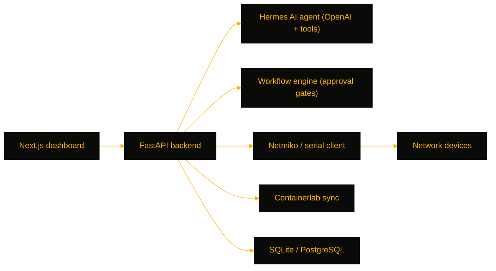

# hermes-switch-manager

> Single-dashboard config management for mixed-vendor switch fleets — SSH/serial backup, change gating, and CVE/compliance auditing with an AI operator, for network engineers managing Cisco, Aruba, Juniper, Arista, and Linux gear.

[](https://github.com/OneByJorah/hermes-switch-manager)
[](https://github.com/OneByJorah/hermes-switch-manager)
[](https://github.com/OneByJorah/hermes-switch-manager/stargazers)
[](https://github.com/OneByJorah/hermes-switch-manager/commits)


[](https://github.com/OneByJorah/hermes-switch-manager/actions)

## What This Is

Backing up and changing switch configs by hand across a mixed-vendor fleet loses track of who changed what and why. hermes-switch-manager keeps one place for backup, diff, and deploy: it connects over Netmiko SSH or a serial console, captures SHA-256-hashed config snapshots, and runs risky changes through an approval-gated workflow engine. It is intended for network teams that need repeatable operations and an audit trail on Cisco, HP Aruba, Juniper, Arista, and Linux devices.

This repo was consolidated with **nethermind**; serial console support and the Jinja2 template engine now live here. See [MIGRATION.md](MIGRATION.md).

## Quick Start

```bash
git clone https://github.com/OneByJorah/hermes-switch-manager.git && cd hermes-switch-manager
cp .env.example .env   # set OPENAI_API_KEY and SSH credentials
docker compose up -d
```

Open **http://localhost:3000** (frontend); the API runs at **http://localhost:8000**.

## Features

- SHA-256-hashed config backups with change detection and diff per switch
- Netmiko SSH plus pyserial RS-232/USB out-of-band console access
- OpenAI-powered agent with tool calling, streamed over SSE, for natural-language operations
- IRIS-style workflow engine with per-step approval gates and audit trail
- Security audits: CVE scanning, ACL/AAA checks, CIS/NIST-oriented findings per switch or fleet-wide
- Vendor-agnostic Jinja2 template engine with built-in ArubaOS-oriented templates
- Parses containerlab `.clab.yml` topologies and syncs lab devices alongside real gear
- Device health metrics (CPU, memory, interfaces) tracked over time

## Architecture


```mermaid
%%{init: {'theme':'base','themeVariables':{'primaryColor':'#0a0a09','primaryTextColor':'#FFB300','lineColor':'#FFB300'}}}%%
flowchart LR
  UI["Next.js dashboard"] --> API["FastAPI backend"]
  API --> AI["Hermes AI agent (OpenAI + tools)"]
  API --> WF["Workflow engine (approval gates)"]
  API --> SSH["Netmiko / serial client"]
  API --> CLAB["Containerlab sync"]
  API --> DB["SQLite / PostgreSQL"]
  SSH --> SW["Network devices"]
```

## Stack

FastAPI, SQLAlchemy, Netmiko, pyserial, Jinja2, OpenAI SDK, Next.js (TypeScript), Tailwind CSS, SQLite/PostgreSQL, Docker Compose.

## Contributing

Contributions are welcome — read [CONTRIBUTING.md](CONTRIBUTING.md), then [open an issue](https://github.com/OneByJorah/hermes-switch-manager/issues).

## License

MIT — see LICENSE.
