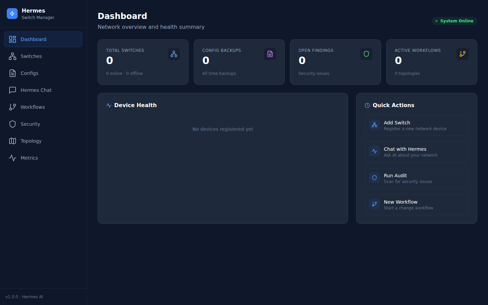
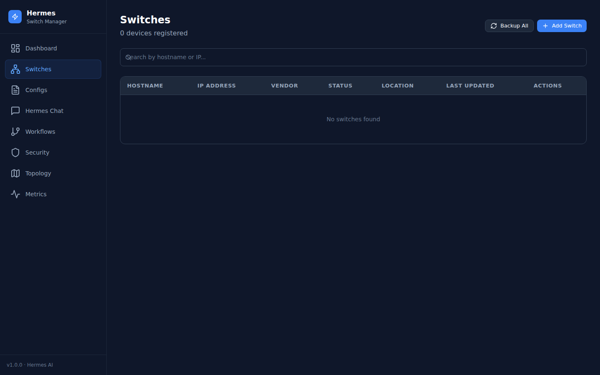
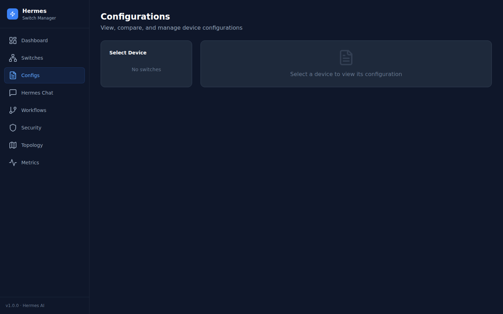
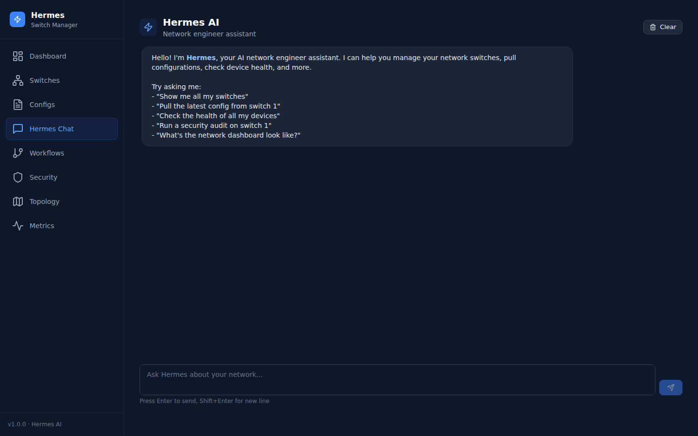
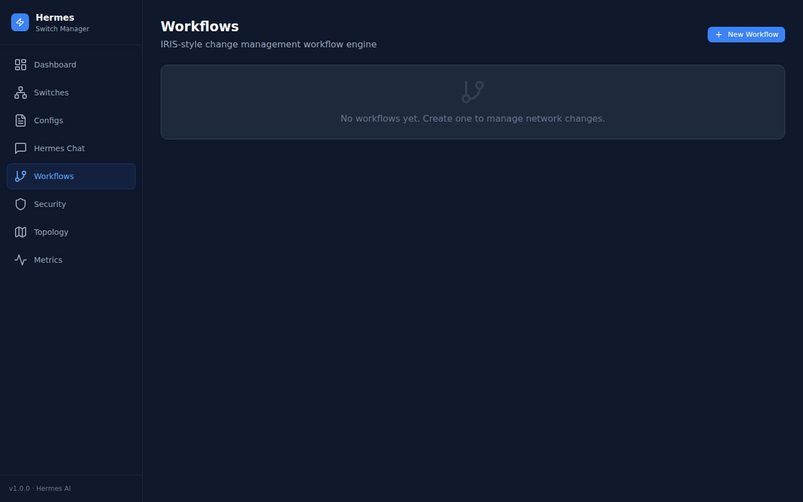
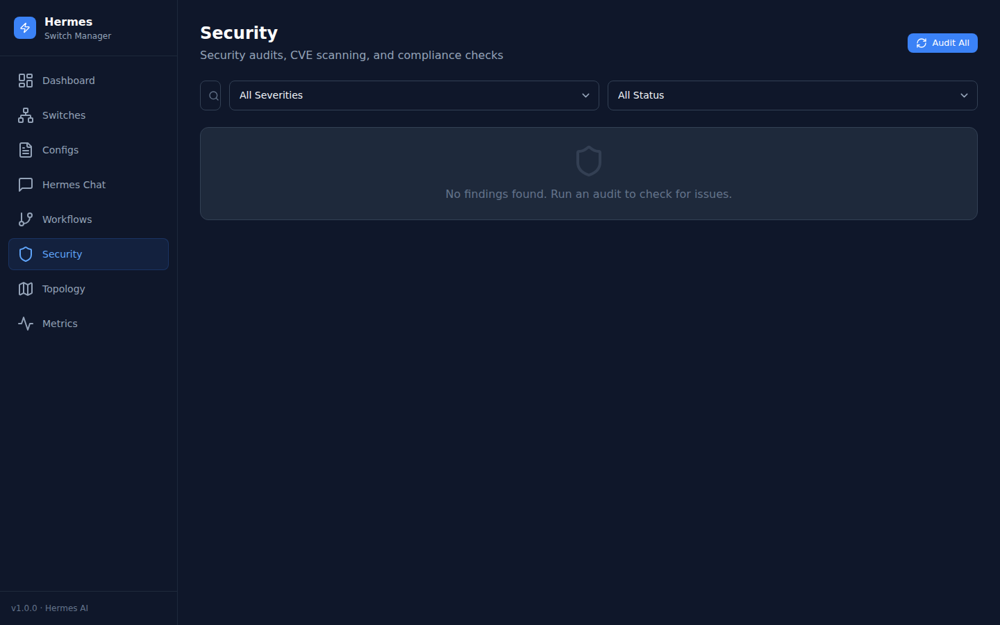
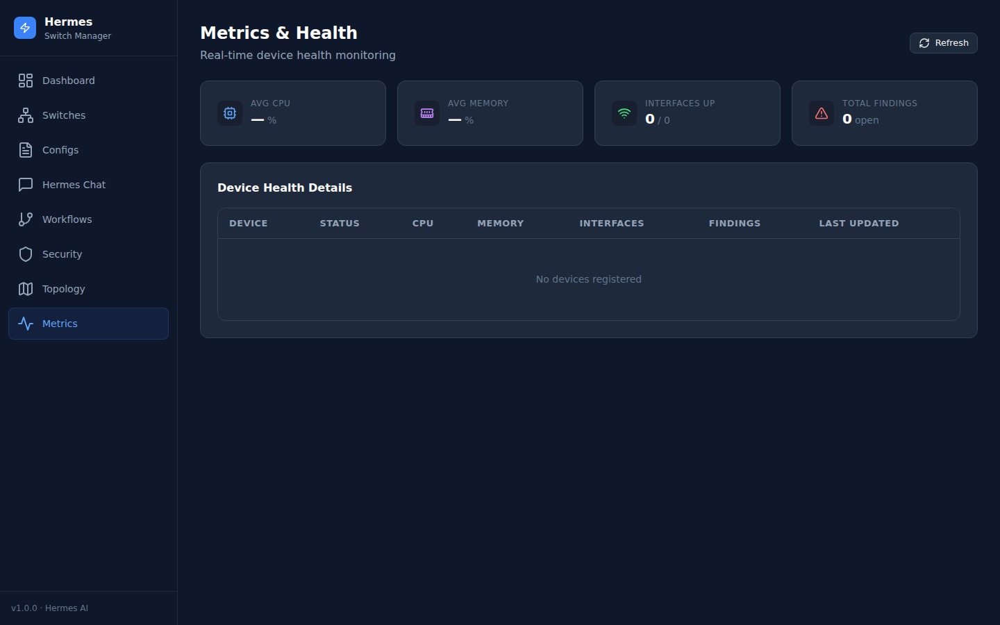
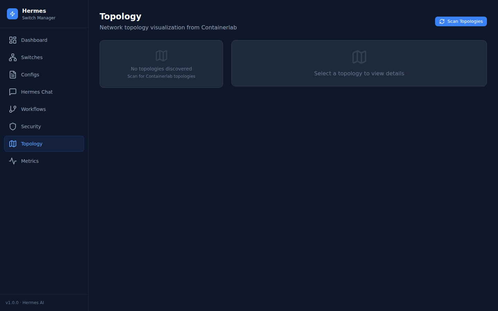

<div align="center">


# hermes-switch-manager

**AI-powered network switch config management** — multi-vendor SSH and serial operations, Jinja2 templates, an AI chat agent, and security auditing in one dashboard.

<a href="https://github.com/OneByJorah/hermes-switch-manager/stargazers"></a>
<a href="https://github.com/OneByJorah/hermes-switch-manager/commits"></a>


</div>

## Quick Start

```bash
git clone https://github.com/OneByJorah/hermes-switch-manager.git
cd hermes-switch-manager
cp .env.example .env   # set OPENAI_API_KEY and SSH credentials
docker compose up -d
```

Open **http://localhost:3000** (frontend) — the API runs at **http://localhost:8000**.

## What This Is

hermes-switch-manager gives network engineers one place to back up configs, push changes, and audit a mixed-vendor fleet. It connects over Netmiko SSH or a serial console, keeps immutable config snapshots and audit logs, and adds an AI agent plus a disciplined workflow engine for changes that shouldn't be done by hand. It is intended for teams running Cisco, HP Aruba, Juniper, Arista, and Linux network gear.

> [!NOTE]
> This repository has been consolidated with **nethermind**; serial console support and the Jinja2 template engine were merged in here. See [MIGRATION.md](MIGRATION.md).

## Features

- **Multi-vendor support** — Cisco, HP Aruba, Juniper, Arista, and Linux devices.
- **SSH + serial console** — Netmiko for SSH, pyserial for out-of-band RS-232/USB access.
- **AI chat assistant** — OpenAI-powered agent with tool calling for natural-language network operations, streamed over SSE.
- **IRIS-style workflow engine** — stepwise change management with human approval gates and a per-step audit trail.
- **Security auditing** — CVE scanning, ACL/AAA checks, and CIS/NIST-oriented compliance findings.
- **Jinja2 templates** — built-in templates for common tasks (ArubaOS-oriented, vendor-agnostic engine).
- **Config backup & diff** — SHA-256-hashed running-config snapshots with change detection.
- **Containerlab integration** — parses `.clab.yml` topologies and syncs lab devices.
- **Device health metrics** — CPU, memory, and interface status over time.
- **Immutable audit trail** — every action logged with actor, target, and timestamp.

## Architecture

```
┌─────────────┐     ┌─────────────────────────────────────────────┐
│  Frontend    │     │  Backend (FastAPI)                          │
│  (Next.js)   │◄───►│                                              │
│  :3000       │     │  Routers → Services → Database             │
└─────────────┘     │                                              │
                    │  ┌─────────────────┐  ┌──────────────────┐  │
                    │  │ Hermes AI Agent │  │ Workflow Engine  │  │
                    │  │ (OpenAI + Tools)│  │ (IRIS-style)     │  │
                    │  └────────┬────────┘  └────────┬─────────┘  │
                    │           │                     │            │
                    │  ┌────────▼────────┐  ┌────────▼─────────┐  │
                    │  │ Netmiko Client  │  │ Security Auditor │  │
                    │  │ (SSH to devices)│  │ (CVE/ACL/AAA)    │  │
                    │  └─────────────────┘  └──────────────────┘  │
                    │  ┌──────────────────────────────────────┐   │
                    │  │ Containerlab Service                 │   │
                    │  │ (.clab.yml parser + sync)            │   │
                    │  └──────────────────────────────────────┘   │
                    └──────────────────────────────────────────────┘
                                      │
                         ┌────────────▼────────────┐
                         │    Database (SQLite/PG)  │
                         │  Switches, Configs,      │
                         │  Workflows, Findings,    │
                         │  Metrics, Audit Logs     │
                         └─────────────────────────┘
```

## API Endpoints

| Endpoint | Method | Description |
|----------|--------|-------------|
| `/api/switches` | GET/POST | Manage network switches |
| `/api/configs/{id}` | GET | Retrieve a device configuration |
| `/api/chat/stream` | POST | Stream a reply from the Hermes AI agent |
| `/api/workflows` | GET/POST | Manage configuration workflows |
| `/api/security/audit/{switch_id}` | POST | Run a security audit on one switch |
| `/api/security/audit-all` | POST | Run security audits on all switches |
| `/health` | GET | Backend health check |

## Configuration

Copy `.env.example` to `.env` and set real values:

| Variable | Default | Description |
|----------|---------|-------------|
| `DATABASE_URL` | `sqlite:///./switches.db` | Database connection string |
| `OPENAI_API_KEY` | *(empty)* | OpenAI API key for the Hermes AI agent |
| `OPENAI_MODEL` | `gpt-4o` | Model used by the agent |
| `SSH_USERNAME` | `admin` | Default SSH username for devices |
| `SSH_PASSWORD` | *(empty)* | Default SSH password |
| `SSH_TIMEOUT` | `30` | SSH connection timeout (seconds) |
| `SECRET_KEY` | `<set-value>` | Application secret key |
| `CORS_ORIGINS` | `http://localhost:3000,http://localhost:5173` | Allowed frontend origins |
| `CLAB_DIR` | `/etc/containerlab/lab` | Containerlab lab directory |
| `LOG_LEVEL` | `INFO` | Log verbosity |
| `NEXT_PUBLIC_API_URL` | `http://localhost:8000` | Frontend → backend API base URL |

> [!WARNING]
> `docker-compose.yml` runs the backend with `./backend` bind-mounted and default SQLite storage. For production, uncomment the PostgreSQL service, set `POSTGRES_PASSWORD`, and switch `DATABASE_URL` to PostgreSQL.

## Local Development

```bash
# Backend
cd backend
pip install -r requirements.txt
uvicorn main:app --reload --port 8000

# Frontend
cd frontend
npm install
npm run dev
```

## Use Cases

1. **Network engineers** — back up and diff configs across a mixed-vendor fleet.
2. **Change management** — gate risky config changes behind the workflow engine.
3. **Security teams** — run repeatable CVE/AAA/compliance audits.
4. **Lab engineers** — manage containerlab topologies alongside real devices.

## Tech Stack

FastAPI, SQLAlchemy, Netmiko, pyserial, Jinja2, OpenAI SDK, Next.js (TypeScript), Tailwind CSS, SQLite/PostgreSQL, Docker Compose.

## Screenshots

| View | Preview |
|------|---------|
| Dashboard |  |
| Switches |  |
| Configs |  |
| AI chat |  |
| Workflows |  |
| Security |  |
| Metrics |  |
| Topology |  |

## Project Structure

```
hermes-switch-manager/
├── backend/                 # FastAPI app
│   ├── main.py
│   ├── routers/             # API endpoints
│   ├── services/            # netmiko, serial, AI agent, workflows, auditing
│   └── models/              # SQLAlchemy models
├── frontend/                # Next.js dashboard
├── docker-compose.yml       # Backend + frontend deployment
├── .env.example
├── install.sh / install.ps1
└── docs/                    # Architecture + assets
```

## Contributing

Contributions are welcome. Please read [CONTRIBUTING.md](CONTRIBUTING.md) and [CODE_OF_CONDUCT.md](CODE_OF_CONDUCT.md), then [open an issue](https://github.com/OneByJorah/hermes-switch-manager/issues) or a pull request.

## License

MIT — see [LICENSE](LICENSE).

## Connect

- [jorahone.com](https://jorahone.com)
- [GitHub Org](https://github.com/OneByJorah)
- [info@jorahone.com](mailto:info@jorahone.com)
